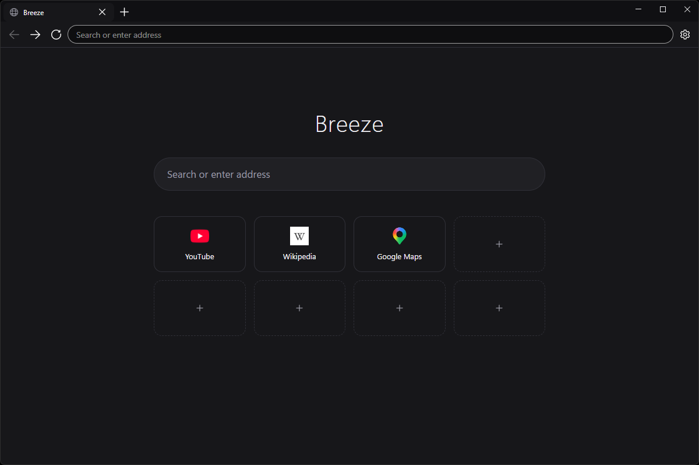
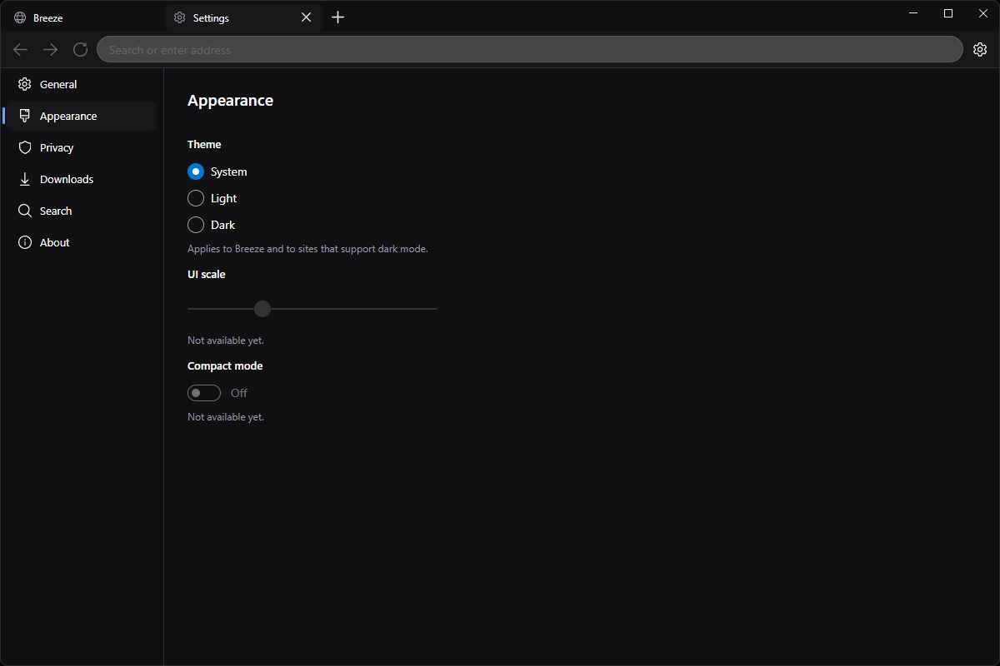

# Breeze

A lightweight, privacy-focused web browser built with Avalonia and WebView2.

> Breeze currently targets Windows. Linux and macOS are not supported.

<p align="center">
  
  
</p>

## Project Status

Breeze is under active development. Expect breaking changes, UI refinements and new features
until the first stable release.

## What works

- Tabs: open, close, switch, and drag to reorder. Closing the last tab closes the window.
- Address bar: URLs navigate, anything else searches with the selected engine.
- Back, forward, reload and stop.
- A bundled homepage served from disk with a search box and manually managed shortcuts
  (create, edit, delete, drag to reorder), stored as readable JSON.
- Favicons for shortcuts, discovered from the site and cached on disk.
- A settings page hosted in a tab as native UI, covering startup page, theme, search engine,
  the download folder, and clearing history, cookies and cache.
- Light and dark themes, applied to the Breeze UI, the homepage, and passed to sites through
  the engine's preferred colour scheme.

## Not implemented yet

These are absent, not merely unfinished, and are worth knowing before you rely on Breeze as a
daily browser:

- **Downloads UI.** Downloads use the engine's own UI. Files are placed in the configured
  folder with a sanitised name, but there is no download list, no "ask where to save" prompt,
  and no handling of dangerous file types.
- **Permission prompts.** Requests for camera, microphone, location, notifications and
  clipboard read are refused outright, with no way to allow them.
- **History and bookmarks.** Browsing history is kept by the engine and can be cleared from
  settings, but there is no history or bookmarks UI.
- **Find in page, PDF controls, zoom controls, incognito mode, extensions, profiles, sync.**
- **UI scale and compact mode** appear in settings but are disabled.

## Privacy

Breeze is built to keep browsing data on the machine. What that means concretely:

- Breeze itself contains no analytics, no crash reporting and no usage statistics. It sends
  nothing to any Breeze-operated service, because none exists.
- All data lives in `%LOCALAPPDATA%\Breeze`: the WebView2 profile, cached favicons, your
  shortcuts, your settings, and a local error log. Nothing is uploaded and there is no account.
- Tracking prevention is set to strict, browser extensions are disabled, and password saving
  and autofill are off.
- Edge reputation checking (SmartScreen), which sends visited URLs to a Microsoft service, is
  explicitly disabled.
- Search queries go to the engine you select. Favicons are fetched from the site itself, never
  through a third-party icon service, and never from local or private network addresses.

Two honest caveats:

- **"Zero telemetry" is not a claim we can currently make.** Breeze adds none, and the known
  URL-reporting channel is switched off, but Breeze embeds the Microsoft Edge WebView2 runtime
  and we have not yet verified with a network capture that the runtime makes no optional
  connections of its own. Until that verification is published, treat this as "no telemetry
  added by Breeze" rather than "no telemetry at all".
- **Local data is not encrypted.** Anything running as your user account can read your
  shortcuts, settings, cache and cookies. Breeze does not defend against that.

## Security posture

Breeze has had one internal security review; findings rated critical and high were fixed, and
the notable ones are worth stating plainly:

- The homepage is the only origin allowed to talk to the host process, matched on parsed
  origin, and host messaging is switched off on every other page.
- Remote pages cannot navigate a tab onto Breeze's internal pages.
- Shortcut URLs are restricted to `http` and `https` on save and on load, and the homepage
  carries a restrictive content security policy.
- Downloads are confined to the configured folder with sanitised names.
- Requests to open new windows become tabs, so nothing renders without a visible address bar.
- Favicon discovery rejects non-web schemes and any destination, including redirect targets,
  that resolves to a loopback, private or link-local address.

Breeze is an early-stage project and has not yet undergone an external security audit. See
[SECURITY.md](SECURITY.md) to report an issue.

## Building

Requires the .NET 10 SDK and the Microsoft Edge WebView2 runtime (present on current Windows
installs).

```bash
dotnet build
dotnet run --project Breeze
```

## Roadmap

### Browsing

- [ ] Bookmarks
- [ ] History page
- [ ] Downloads manager
- [ ] Find in page
- [ ] Reopen closed tab
- [ ] Restore previous session
- [ ] Pinned tabs
- [ ] Mute tabs
- [ ] Incognito mode

### Homepage

- [ ] Loading animation in the favicon position while a shortcut is being created instead of delaying the shortcut until the favicon finishes downloading.
- [ ] Import/export shortcuts
- [ ] Homepage customization

### User Interface

- [ ] Compact mode
- [ ] UI scaling
- [ ] Keyboard shortcut customization
- [ ] Custom accent colors

### Privacy & Security

- [ ] Permission prompts
- [ ] Complete a network capture of an idle Breeze session to validate privacy claims
- [ ] Cookie and site data controls

### Long-term

- [ ] Multiple user profiles
- [ ] Guest mode
- [ ] Cross-platform support

## License

Breeze is licensed under the MIT License.
See [LICENSE](LICENSE) for details.
